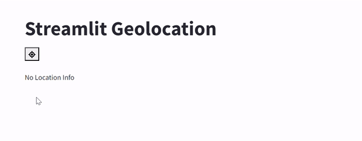

# streamlit-geolocation
A geolocation button for streamlit

### Installation
`pip install streamlit-geolocation`

###Usage
`from streamlit_geolocation import streamlit_geolocation`
`location = streamlit_geolocation()`
`print(location)`
`outputs: {'latitude': 35.9700706, 'longitude': -83.9184362, 'altitude': None, 'accuracy': 12.684, 'altitudeAccuracy': None, 'heading': None, 'speed': None}`

This uses the javascript method navigator.geolocation.getCurrentPosition to get the user's location. The response is a GeolocationCoordinates object.

This is heavily inspired by this repository: https://github.com/aghasemi/streamlit_js_eval 
I am simplifying the scope to just getting the user's location and not evaluating arbitrary javascript, but I owe a lot to the original author.

